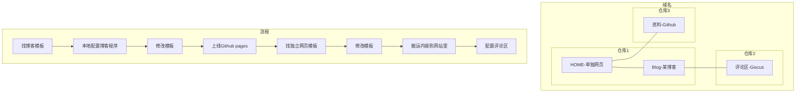

## 短期计划
- [ ] 网站内容结构
  - [ ] 首页显示哪些内容, "关于"中显示哪些个人信息, 侧边栏有哪些栏目以及如何填充安排.
  - [ ] 关于:抄一下简历, 然后极其详尽的写一下自己干过的事. publication现在还没有就先不写.
  - [ ] 可添加子页面:学习计划,记录,以及出行记录和计划.
  - [ ] 加一个fun fact写个人爱好.
- [ ] 网站功能
  - [x] 尝试是否能做到嵌入并预览pdf
  - [x] 加入评论区(基于Disqus, Giscus或其他任意)
  - [x] 在每个外部链接后添加外链符号`fa-external-link` (在`\assets\css\jekyll-theme-chirpy.scss`)
    - [ ] 隐藏部分外部链接后的外链符号(美观)
  - [x] 添加朋友的个人主页作为友链
    - [x] 将友链不放在文章中
  - [x] 设置个人社交平台账号链接,把网页最下面的作者联系方式换掉(不用twitter).
  - [ ] 修复搜索功能
  - [ ] 在网页内嵌入本地图片
- [ ] 杂项
  - [ ] 更改网站icon
  - [ ] 修改`README`
  - [ ] 把自己本地仓库的东西同步到GitHub上,然后设置分享链接到这里.
  - [ ] 增加Edit按钮,如[Add "Edit this post" link #2067](https://github.com/cotes2020/jekyll-theme-chirpy/issues/2067#issuecomment-2507385052).

## 长期计划
- [x] MathJax的修改: 现有网站在MathJax上的适配我很难评价, 在右键菜单中语言改不了中文.而且我需要一些默认导入的宏包作为preamble.
> 实际情况是之所以右键菜单的语言不能改,是因为我用的是MathJax v3, 而那些可以改的是用旧版v2. 自定义命令没办法只能用AI改成MathJax中`configmacros`的macros (JS格式). 最后`\everymath{displaystyle}`使用了[Convertion from MathJax 2 to MathJax 3](https://groups.google.com/g/mathjax-users/c/2AkUeJ5tboA/m/c9SdpSH7CAAJ)的方案.
- [x] 优化搜索: 基于[Chirpy主题的进阶使用](https://ittousei.github.io/posts/customize-my-blog/)再改一些文件, 还得改一些static asset. 需要注意的是在我fork的Chirpy主题仓库中, [static asset](https://github.com/cotes2020/chirpy-static-assets)是作为子仓库出现的,所以改起来很麻烦.除非像Ittousei一样不直接fork而直接当作压缩包clone.
> 在首页的文章预览文字中一旦出现反斜杠`\`之类影响json转义的都会导致Simple Jekyll Search报错.根据上面链接的源代码修复.另外也根据上文及其[仓库](https://github.com/ittousei/ittousei.github.io)中源代码优化了本网页的搜索功能.
- [ ] 支持中英文切换. 似乎Chirpy模板只能支持一个(默认)语言,除非我再弄一个英文网页作为子网页,似乎较困难,可能得无限期拖延了. 因为我没有本质需要双语的场合, 除非我希望把我的东西分享给外国人看.

## 其他

朋友在开始搭网站时给我写的示意图:

但其实并没有完全按照这个来.现在的情况是:
- 在一步步妥协后选择了现有的Jekyll框架及其上的Chirpy主题,大刀阔斧的改动太困难而最终只能修补一下侧边栏和首页.
- Giscus加上去了(也感谢Jekyll不然似乎挺麻烦), 但剩下还有一些东西要做(如上).

原本的构想是首页单独做一个页面,从首页入口进入Blog,但Chirpy模板中首页很复杂且都是用Liquid+html做的,看不懂所以改不了.

最后, 在本模板下各种文本用例可参照[写作语法示例](https://pansong291.github.io/chirpy-demo-zhCN/posts/writing-syntax-example),还是挺有用的.